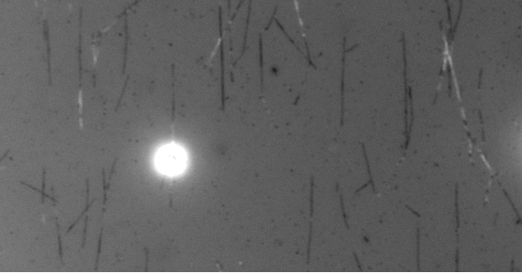
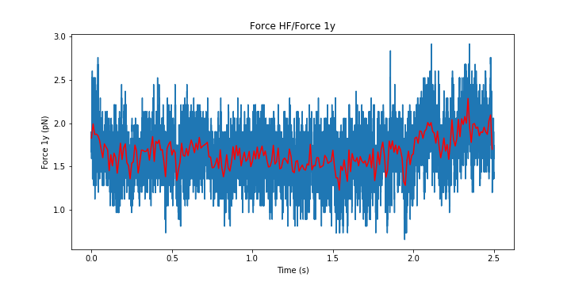
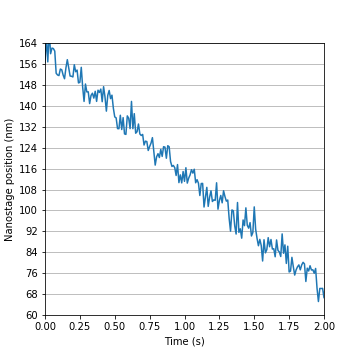

Force Clamp - Kinesin Attached to a Bead Walking on Microtubule
===============================================================

In this assay we had microtubules on the surface. We trapped beads with Kinesin (molecular motor) and had ATP inside the assay. As we lowered the kinesin-coated beads on top of a microtubule, it attached to it and started stepping on the microtubule. Kinesins were pulling the bead out of the center of the trap and thus increasing the force on the bead.

At a certain (set) force, we turn the force clamp on and the nanostage moves towards the motion of the bead. Now the force stays constant, and we get an idea of how the motor steps by looking at the motion of the nanostage.

With the IRM, you can see unlabeled microtubules and the kinesin-coated bead on top of one of them.

Install Pylake, in case it's not installed::

    !pip install lumicks.pylake

Load the relevant libraries::

    import numpy as np
    import matplotlib.pyplot as plt

    from lumicks import pylake

Open the file::

    filename = r'20190215-142512 Marker force clamp.h5';
    data = pylake.File(filename)

Look at the contents of the file::

    >>> print(data)

    File root metadata:
    - Bluelake version: Unknown
    - Description: 
    - Experiment: 
    - GUID: {E77F9E67-182F-4BB5-ABB0-14CDB9068600}
    - Export time (ns): 1550237112593852547
    - File format version: 2

    Diagnostics:
    Nano X:
    - Data type: float64
    - Size: 1943676
    Nano Y:
    - Data type: float64
    - Size: 1943676
    Nano Z:
    - Data type: float64
    - Size: 1943676

    Force HF:
    Force 1x:
    - Data type: float64
    - Size: 1943676
    Force 1y:
    - Data type: float64
    - Size: 1943676

Load the data::

    # Force in the y direction (pN)
    forcey = data['Force HF']['Force 1y']['6s':'8.5s']
    # Nanostage position in the y direction (V)
    nanoy = data['Diagnostics']['Nano Y']['6s':'8.5s']
    # time traces (seconds)
    time = forcey.timestamps/1e9
    time = time - time[0]

    sample_rate = data['Diagnostics']['Nano Y'].sample_rate

Downsample the data::

    downsampled_rate = 100 # Hz

    # downsample the force, nanostage position and time
    forcey_downsamp = forcey.downsampled_by(int(sample_rate/downsampled_rate))
    nanoy_downsamp = nanoy.downsampled_by(int(sample_rate/downsampled_rate))
    time_downsamp = forcey_downsamp.timestamps/1e9
    time_downsamp = time_downsamp - time_downsamp[0]

Conversion factor for the nanostage::

    # this is determined for each nanostage and it has 3 different conversion factors for the 3 directions (x,y,z)
    conv_fact = 50000/(1.849-0.04933) #nm/V
    
Force versus Time
-----------------

Plot it::

    fig = plt.figure(figsize=(10,5))

    forcey.plot()
    forcey_downsamp.plot(color='r')
    plt.ylabel('Force 1y (pN)')

    plt.savefig("../../docs/examples_by_segments/cytoskeletal_kinesin_bead_closed_loop_fig1.png")

Determine force fluctuations::

    >>> print('Mean force is: '+str(np.mean(forcey_downsamp.data)) + ' pN' )
    >>> print('Variation in the force is: '+str(np.std(forcey_downsamp.data)) + ' pN' )

    Mean force is: 1.6587699919874592 pN
    Variation in the force is: 0.17120278599815678 pN

Here we see that the force stay at 1.7 pN and stays relatively constant

Nanostage Position versus Time
------------------------------

Plot it::

    fig = plt.figure(figsize=(5,5))

    # plot position versus time
    ax = plt.subplot(1,1,1)
    plt.plot(time_downsamp, nanoy_downsamp.data*conv_fact-2000)

    plt.xlim([0, 2])
    plt.ylim([60, 160])

    # create y-ticks for axis
    lims2=[]
    for i in range(14):
        lims2.append(i*8+60)
    ax.set_yticks(lims2)

    # add grid to the graph
    ax.yaxis.grid()

    # label axis
    ax.set_xlabel('Time (s)')
    plt.ylabel('Nanostage position (nm)')

