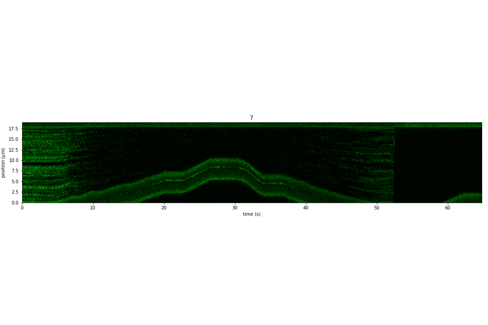

Kymograph and Force
====================

.. only:: html

    :nbexport:`Download this page as a Jupyter notebook <self>`

We have two beads trapped and a DNA attached to both of them at either end. We made sure that we have a single tether of DNA by pulling on them before and doing the FD curve.

We then moved into the channel that contains Sytox-Green. It binds to DNA if the DNA is under tension. We can the scan along the DNA and create kymographs using the confocal part of the system.

As we start the kymographs, we can change the force on the DNA and observe the force dependent binding of Sytox to DNA.

This experiments perfectly demonstrates the correlative capabilities of the C-trap.

Install Pylake, in case it's not installed::

    !pip install lumicks.pylake

Load the relevant libraries::

    import numpy as np
    import matplotlib.pyplot as plt

    from lumicks import pylake

Open the file::

    # Sytox binding, unbinding, with decreased, than increased force
    filename = "20181107-152940 Sytox kymograph 7.h5"

    # load file
    data = pylake.File(filename)

Look at the contents of the file::

    >>> print(file)
    File root metadata:
    - Bluelake version: 1.5.0-alpha.35
    - Description: 
    - Experiment: 
    - GUID: {30C83182-2488-4B27-9EBE-60530CC12D0C}
    - Export time (ns): 1541600980363255800
    - File format version: 1

    Force HF:
    Force 1x:
    - Data type: float64
    - Size: 5059376
    Force 1y:
    - Data type: float64
    - Size: 5059376
    Force 2x:
    - Data type: float64
    - Size: 5059376
    Force 2y:
    - Data type: float64
    - Size: 5059376

    Kymograph:
    7:
    - Data type: object
    - Size: 1
    Photon count:
    Blue:
    - Data type: uint32
    - Size: 5059376
    Green:
    - Data type: uint32
    - Size: 5059376
    Red:
    - Data type: uint32
    - Size: 5059376

Make Kymographs
---------------

List all the kymographs in the file::

    >>> for kymo_name in file.kymos:
    >>>     print(kymo_name)
    7

Load the kymograph in the file::

    # you can either do this and then you have to change which kymo you load for every file:
    kymo_data = file.kymos["7"] # as this file contains kymograph #7

    # ALTERNATIVELY you can either do this and then you don't have to worry about which file you open
    kymos = list(file.kymos)
    kymo_data = file.kymos[kymos[0]]

Plot the red channel::

    fig = plt.figure(figsize=(15,10))

    # here you select the kymo
    kymo = file.kymos["7"]
    kymo.plot_green()
    plt.tight_layout()

Note that we can also scale the colorbar of the image.

This is not so straightforward, here we just show a very simple way of doing it.

Get the raw data out of the kymographs::

    blue_date = kymo.blue_image
    green_date = kymo.green_image
    red_date = kymo.red_image

    # this gives you the timestamps if you want to produce the kymos yourself
    timestamps = kymo.timestamps

Get a sense of the pixel values in the kymos

    >>> max_px = np.max(green_date)
    35
    >>> min_px = np.min(green_date)
    0

Scale the colorbar and make the kymograph look better::

    fig = plt.figure(figsize=(15,10))

    file.kymos["7"].plot_green(vmax=10)
    plt.tight_layout()

Force versus Time
-----------------

Load the data::

    # Force in the x direction (pN)
    forcex = data['Force HF']['Force 1x']

    # time traces (seconds)
    time = forcex.timestamps/1e9
    time = time - time[0]

    sample_rate = forcex.sample_rate

Downsample the data::

    downsampled_rate = 100 # Hz

    # downsample the force, nanostage position and time
    forcex_downsamp = forcex.downsampled_by(int(sample_rate/downsampled_rate))
    time_downsamp = forcex_downsamp.timestamps/1e9
    time_downsamp = time_downsamp - time_downsamp[0]

Plot Force::

    fig = plt.figure(figsize=(10,5))

    forcex.plot(label="Original")
    forcex_downsamp.plot(color='r',label="Downsampled")
    plt.ylabel('Force 1x (pN)')
    plt.xlim([0,max(time)])
    plt.legend()
    plt.tight_layout()

Correlated Force and Confocal
-----------------------------

Plot the final figure::

    fig = plt.figure(figsize=(15,10))

    plt.subplot(2,1,1)
    file.kymos["7"].plot_green(vmax=10)

    plt.subplot(2,1,2)
    forcex.plot(label="Original")
    forcex_downsamp.plot(color='r',label="Downsampled")
    plt.xlim([0,max(time)])
    plt.ylabel('Force 1x (pN)')
    plt.tight_layout()

We see when we decreased the force on the DNA the Sytox unbound. As soon as we increase the tension back, we see Sytox binding again. At around 52 seconds, the DNA tether broke, which is why the force went back to it's original position.
