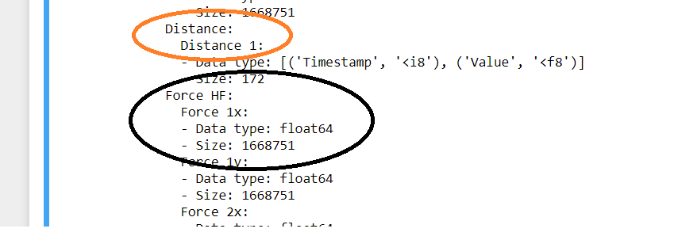
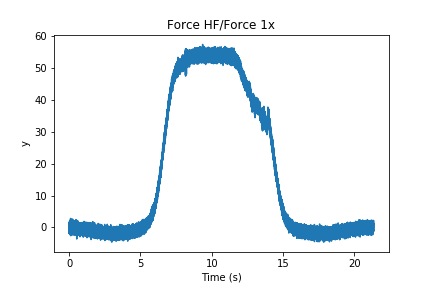
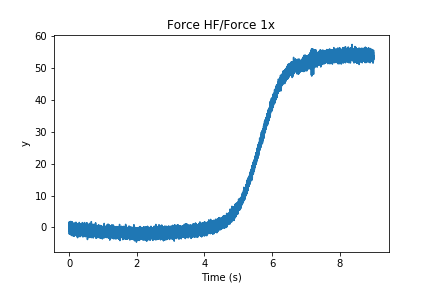
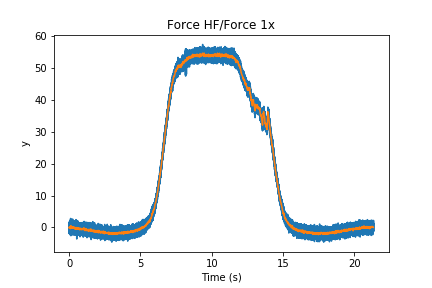
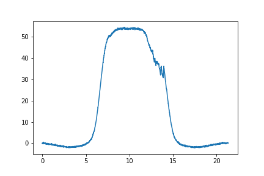
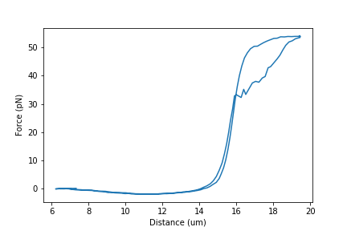
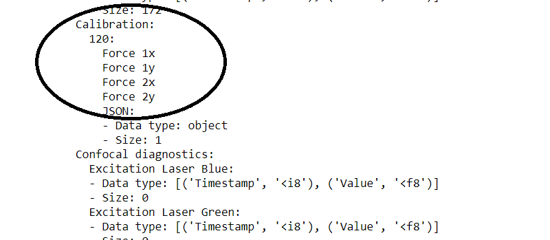

Python
======

The script for this page with sample data can be downloaded from here.

This page explains how to open .h5df files  in Python (Jupyter Notebook) and what you can do with each variable

You would need to use Pylake to easily access data in the exported files. You only have to run this script once to make sure Pylake is installed::

    !pip install lumicks.pylake

If it says "Requirement already satisfied", then no need to run this each time you run a script.

Load libraries so that you can analyze the exported data::

    # Pylake package that LUMICKS provides
    import lumicks.pylake as pylake

    # standard python toolkit for more elaborate mathematical operations
    import numpy as np

    # plotting library
    import matplotlib.pyplot as plt 

Load Files
----------

To load one file, we need to run the following lines of code::

    filename = r'20181121-174038 Marker Single tether.h5'
    f = pylake.File(filename)

In Python, we can also get a list of all the files in one folder, and we can store this list and load the files one by one::

    # load a library to look for files in a folder
    import glob

    # select the folder, here we search for .h5 files in the folder where you're running the script in
    files = glob.glob('*.h5')
    print("found {} files in folder".format(len(files)))

    for file in files:
        print(file)
        f = pylake.File(file)
        # do the operation on each file here

List the Content of a File 
--------------------------

We can view the structure of a loaded file like this::

    >>> filename = 'Data/20181121-174038 Marker Single tether.h5'
    >>> f = pylake.File(filename)
    >>> print(f)

    File root metadata:
    - Bluelake version: 1.5.0-fix-timeout.1
    - Description: 
    - Experiment: 
    - GUID: {45D771E7-E9BA-4255-B4A2-AE00B8F1715E}
    - Export time (ns): 1542818438986002600
    - File format version: 1

    Calibration:
    120:
        Force 1x
        Force 1y
        Force 2x
        Force 2y
        JSON:
        - Data type: object
        - Size: 1

    Distance:
    Distance 1:
    - Data type: [('Timestamp', '<i8'), ('Value', '<f8')]
    - Size: 172
    Force HF:
    Force 1x:
    - Data type: float64
    - Size: 1668751
    Force 1y:
    - Data type: float64
    - Size: 1668751
    Force 2x:
    - Data type: float64
    - Size: 1668751
    Force 2y:
    - Data type: float64
    - Size: 1668751

There are two types of variables in these files in general:

1. Time-traces, e.g. force, distance recordings, confocal recordings, photon count

2. Events, e.g. trap calibration, zeroing the force

Let's look at the first type.

Access Time-Traces / Channels
----------------------
    

- "f" is the file that you previously selected
- the first bracket is the type of variable you're interested in. These are the leftmost items in the list (e.g. Distance or Force)
- the second bracket is the secondary item in that list. E.g. "Force 1x" is located inside "Force HF"

So a sample code would be like this::

    force1x = f["Force HF"]["Force 1x"]

    # or

    distance = f['Distance']['Distance 1']

**Then you can use different commands on these files**:

* ``.plot()`` to plot these items

* ``['0s':'10s']`` to slice them

* ``.sample_rate`` to obtain the sampling rate of this variable

* ``.downsampled_by(100)`` to downsample the by 100 fold

* ``.data`` to obtain the raw data from these files

* ``.timestamps`` to obtain the time data ponts from this data (note that time is in nanoseconds)

**AND you can also combine these command**

``.plot()`` plots the different measured parameters, e.g. force::

    plt.figure()

    force1x.plot()

``['1s':'10s']`` slices them to look at only a certain section of the data::

    force1x['1s':'10s'].plot()

``.sample_rate`` gives you the sampling rate in Hz::

    >>> sampling_rate = force1x.sample_rate
    >>> print(sampling_rate)
    78125

``.downsampled_by(100)`` downsamples the force to a certain sampling frequency::

    final_sampling_rate = 100 #Hz
    force1x_100Hz = force1x.downsampled_by(int( sampling_rate / final_sampling_rate ))

Now we can plot the downsampled force with the original::

    force1x.plot()
    force1x_100Hz.plot()

We can also get the RAW data out and plot them ourselves::

    force_data = force1x_100Hz.data
    force_time = force1x_100Hz.timestamps

    """ Please NOTE that the time data are in NANOSECONDS

        We can convert them to seconds in this way, you subtract the first (zeroth) value, then divide by 1e9 (ten to the power of nine)
    """ 

    force_time = (force_time - force_time[0]) * 1e-9

    # plot them
    plt.plot(force_time, force_data)

Plot Force-Distance Curve
-------------------------

We can make the same plot as before with the obtained data::

    force_data = f["Force LF"]["Force 1x"].data
    distance_data = f["Distance"]["Distance 1"].data

    plt.plot(distance_data, force_data)

    """Now you have to label the axis yourselves"""

    plt.xlabel("Distance (um)")
    plt.ylabel("Force (pN)")

Access Events (e.g. calibration)
-------------------------

These are the second type of variables, that are recorded at one point in time and not continuously.

In terms of calibration events, we have 1 in the dataset that is named "123". We can access it the same way::

    params = f["Calibration"]["120"]["Force 1x"]

**We can also apply certain functions to these files:**

* ``.h5.attrs.items()`` to get a list of what was recorded during this event

* ``.attrs.get()`` to obtain one of the parameters in the marker

``.h5.attrs.items()`` can print the list of calibration paramenters::

    >>> list(params.h5.attrs.items())

    [('Kind', 'Reset offset to zero'),
    ('Offset (pN)', -83.95937128462808),
    ('Response (pN/V)', 817.3620512725377),
    ('Sign', 1.0),
    ('Start time (ns)', 1542807812426015400),
    ('Stop time (ns)', 1542807822426015400),
    ('Bead diameter (um)', 4.4),
    ('Fit range (max.) (Hz)', 23000.0),
    ('Fit range (min.) (Hz)', 10.0),
    ('Fit tolerance', 1e-07),
    ('Max iterations', 10000.0),
    ('Number of samples', 781250.0),
    ('Points per block', 2000.0),
    ('Sample rate (Hz)', 78125.0),
    ('Temperature (C)', 20.0),
    ('Viscosity (Pa*s)', 0.001002),
    ('D (V^2/s)', 0.0013035237229152086),
    ('Rd (um/V)', 8.644328902663627),
    ('Rf (pN/V)', 817.3620512725377),
    ('alpha', 0.6348574679502846),
    ('backing (%)', 100.0),
    ('chi_squared_per_deg', 3.437949600748519),
    ('err_D', 9.46357965045672e-06),
    ('err_alpha', 0.0026906380810170494),
    ('err_f_diode', 143.89781216952397),
    ('err_fc', 4.065413448229771),
    ('f_diode (Hz)', 7140.409949534314),
    ('fc (Hz)', 362.1694334888449),
    ('kappa (pN/nm)', 0.09455471448115298),
    ('ps_fitted', 0.0),
    ('ps_model_fit', 0.0)]

``.attrs.get()`` can grab the parameter of interest, e.g. stiffness::

    >>> stiffness = params.h5.attrs.get("kappa (pN/nm)")
    >>> print(stiffness)
    0.09455471448115298
